# Documentação da Tela — Cadastro de Produtos (Ver. 1.0)

> **Descrição funcional dos componentes de um CRUD de produtos.**

## TELA PRINCIPAL

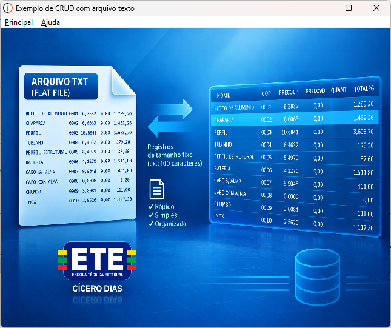

---

## 📌 OBJETIVO DA TELA PRINCIPAL
A tela **Principal (FrmMain)** possui os menus **Principal** e o menu **Ajuda**

Ela permite:
* Chamar o **Cadastro de Produtos**
* Encerrar a operação
* Acesso ao menu **Ajuda**

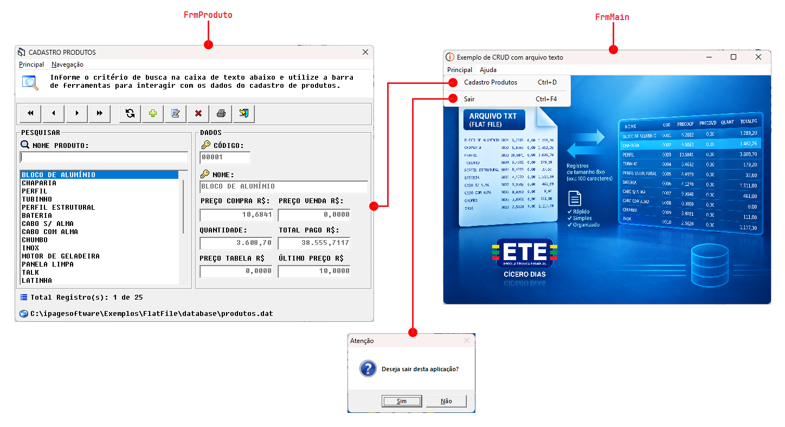

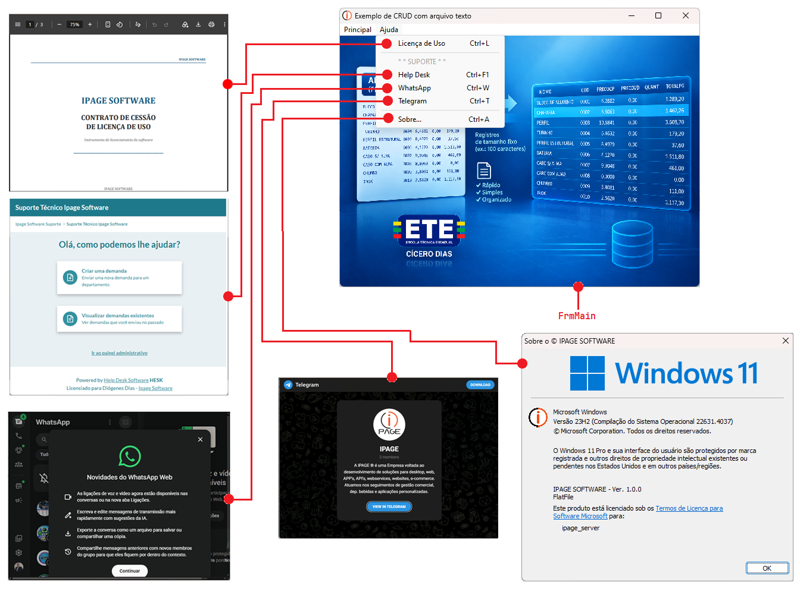

---

## VISÃO GERAL DOS COMPONENTES DA TELA PRINCIPAL E SEUS RESPECTIVOS NOMES

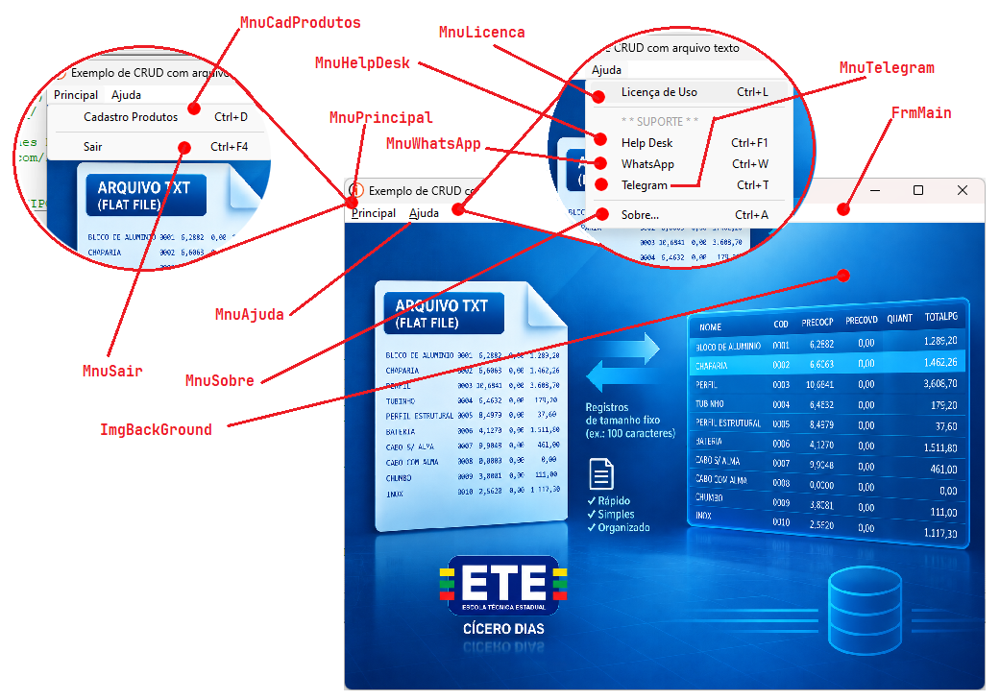

---

## VISÃO GERAL DOS COMPONENTES DA TELA PRINCIPAL E SEUS RESPECTIVOS EVENTOS

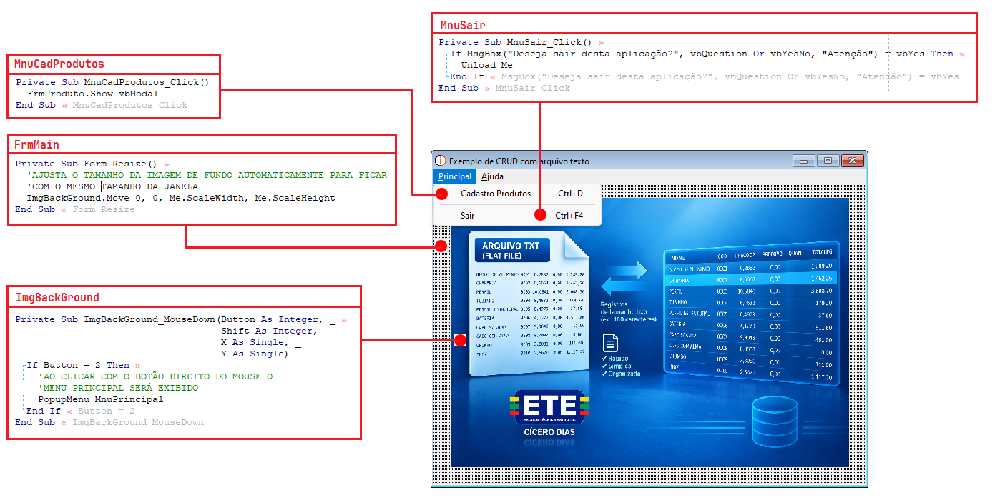

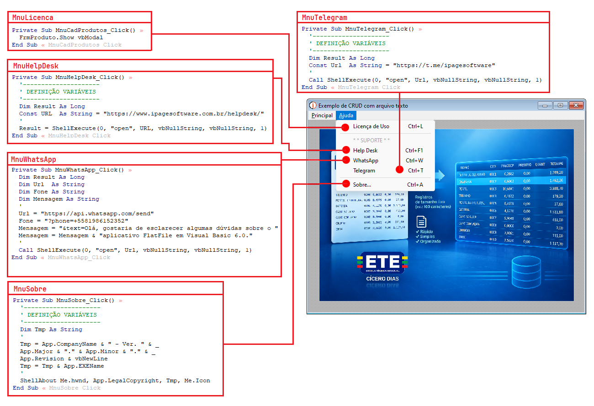

---

## TELA CADASTRO DE PRODUTOS

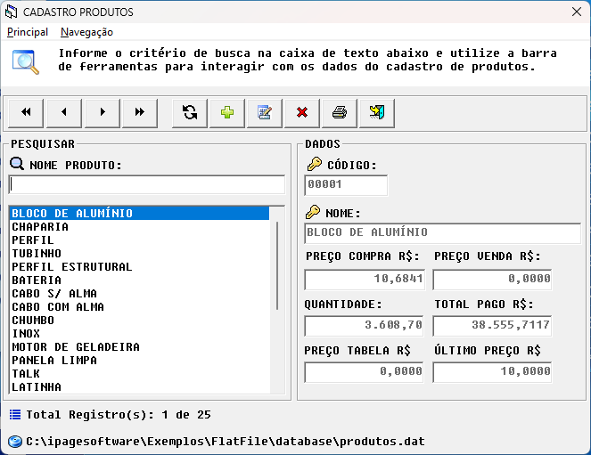

---

## 📌 OBJETIVO DA TELA

A tela de **Cadastro de Produtos** é um CRUD (*Create, Read, Update e Delete*) destinado ao cadastro e à manutenção de produtos.

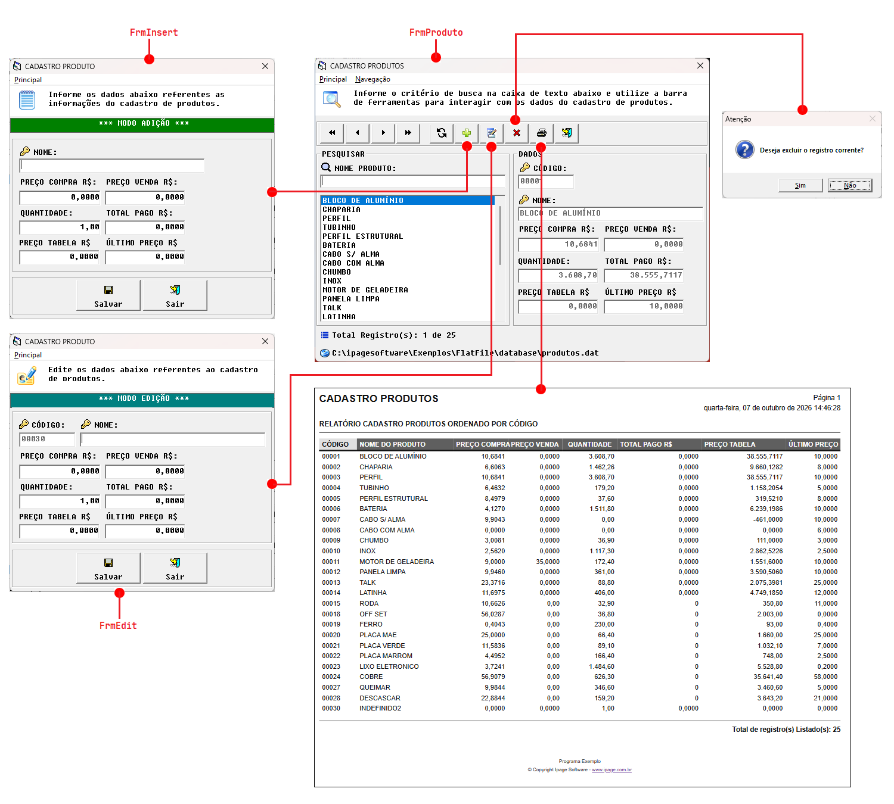

---

Ela permite:
* Localizar registros existentes
* Navegar entre os registros
* Incluir novos produtos
* Alterar dados
* Excluir registros
* Imprimir informações
* Encerrar a operação

## 🔍 IDENTIFICAÇÃO GERAL DOS COMPONENTES

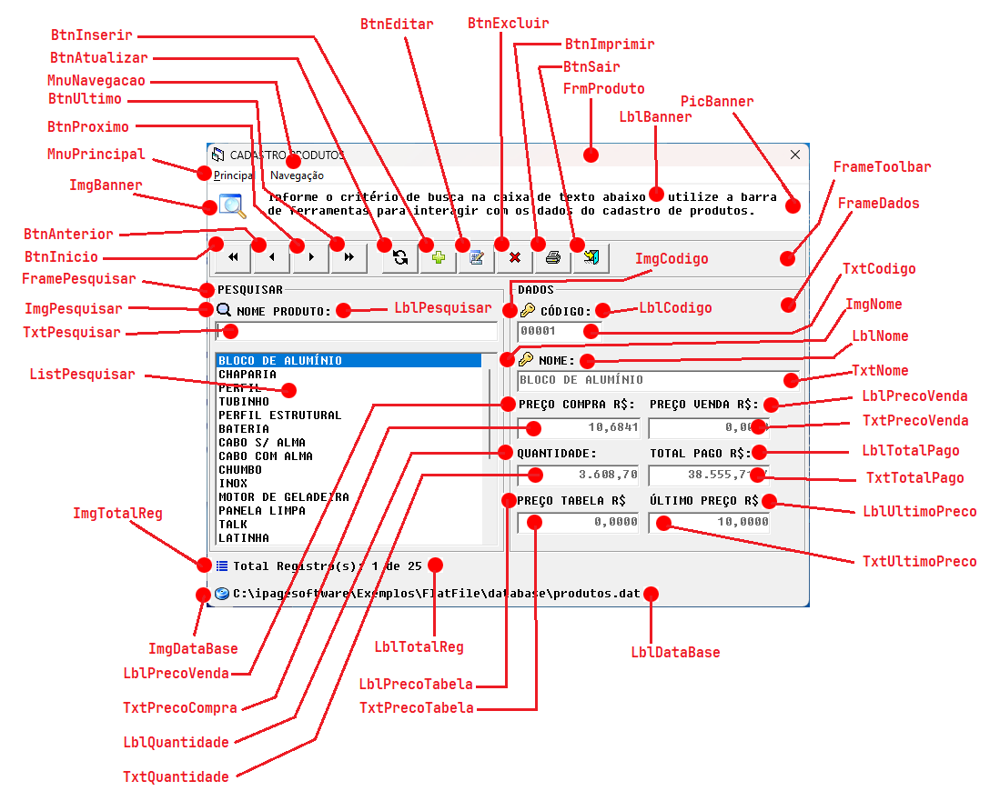

---

| Nº | Componente | Identificação | Descrição |
| :-: | :--- | :--- | :--- |
| **1** | Formulário principal | `FrmProduto` | Contêiner principal de toda a aplicação. Organiza menus, barra de ferramentas, área de pesquisa, dados do produto e informações de status. |
| **2** | Menu Principal | `MnuPrincipal` | Menu superior destinado às operações gerais do cadastro e às funções principais do módulo. |
| **3** | Menu Navegação | `MnuNavegacao` | Menu relacionado à navegação e localização dos registros do cadastro. |
| **4** | Área de orientação | `ImgPesquisa` + `TxtPesquisa` | Informa ao usuário que a caixa de texto deve ser utilizada para pesquisar e que a barra de ferramentas permite interagir com os dados. |
| **5** | Barra de ferramentas |`BtnInicio, BtnAnterior, BtnProximo, BtnUltimo, BtnAtualizar, BtnInserir, BtnEditar, BtnExcluir, BtnImprimir, BtnSair` | Concentra as operações de navegação, atualização, inclusão, alteração, exclusão, impressão e saída. |
| **6** | Grupo de pesquisa | `FramePesquisar` | Área destinada à localização de produtos. |
| **7** | Campo de pesquisa | `TxtPesqusiar` | Caixa de texto utilizada para digitar o nome ou parte do nome do produto a ser localizado. |
| **8** | Lista de produtos | `ListPesquisa` | Exibe os produtos encontrados. O usuário pode selecionar um item para visualizar seus dados no painel à direita. |
| **9** | Contador de registros | `Total Registro(s): 1 de 25` | Indica a quantidade de registros disponíveis e a posição do registro atualmente selecionado. |
| **10** | Grupo de dados | `FrameDados` | Área que apresenta os campos do produto selecionado e permite sua manutenção. |
| **11** | Código | `TxtCodigo` | Identificador do produto. Normalmente corresponde à chave primária do registro. |
| **12** | Nome | `TxtNome` | Descrição/nome comercial do produto. |
| **13** | Preço de compra | `TxtPrecoCoompra` | Valor de aquisição ou custo unitário do produto. |
| **14** | Preço de venda | `TxtPrecoVenda` | Valor utilizado para venda do produto. |
| **15** | Quantidade | `TxtQuantidade` | Quantidade de unidades ou estoque associado ao produto. |
| **16** | Total pago | `TxtTotalPago` | Valor total pago, normalmente relacionado à quantidade adquirida multiplicada pelo preço de compra ou ao valor registrado na operação. |
| **17** | Preço tabela | `TxtPrecoTabela` | Preço de referência/tabela do produto. |
| **18** | Último preço | `TxtUltimoPreco` | Último preço registrado para o produto. |
| **19** | Barra de status | `LblDataBase` | Exibe o local da base de dados utilizada pela aplicação (`produtos.dat`). |

---

## 🛠️ BARRA DE FERRAMENTAS — FUNÇÕES

| Ação | Operação | Função |
| :-: | :--- | :--- |
|  | **Primeiro registro** | Move o cursor para o primeiro produto do cadastro. |
|  | **Registro anterior** | Volta um registro na sequência atual. |
|  | **Próximo registro** | Avança um registro na sequência atual. |
|  | **Último registro** | Move o cursor para o último produto do cadastro. |
|  | **Atualizar** | Atualiza os dados exibidos, relendo ou sincronizando os registros da fonte de dados. |
|  | **Novo / Incluir** | Inicia o cadastramento de um novo produto, limpando/preparando os campos para edição. |
| 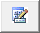 | **Alterar / Editar** | Coloca o produto atual em modo de edição para permitir alterações. |
|  | **Excluir** | Remove o produto selecionado, normalmente após confirmação do usuário. |
| 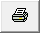 | **Imprimir** | Executa ou prepara a impressão dos dados/relatório relacionado ao cadastro. |
|  | **Sair / Fechar** | Encerra a tela atual ou retorna ao módulo anterior. |

---

## 🔄 FLUXO DE UTILIZAÇÃO DO CRUD

1. **Pesquisar:** O usuário informa o nome do produto no campo `NOME PRODUTO`.
2. **Localizar:** A lista apresenta os produtos compatíveis com o critério informado.
3. **Selecionar:** O usuário seleciona um produto na lista.
4. **Visualizar:** Os campos da área `DADOS` são preenchidos com as informações do registro selecionado.
5. **Navegar:** Os botões *Primeiro*, *Anterior*, *Próximo* e *Último* permitem percorrer os registros.
6. **Incluir:** O botão *Novo* inicia o cadastro de um produto.
7. **Alterar:** O botão *Alterar* permite modificar o produto selecionado.
8. **Excluir:** O botão *Excluir* remove o registro, preferencialmente com confirmação.
9. **Atualizar:** O botão *Atualizar/Recarregar* sincroniza a tela com a fonte de dados.
10. **Imprimir:** O botão *Imprimir* gera a saída impressa ou relatório correspondente.

---

## 🧱 ESTRUTURA LÓGICA SUGERIDA DO CRUD

A tela é organizada conceitualmente em quatro grupos de operações:

* **CREATE (Criar):** Novo cadastro de produto.
* **READ (Ler):** Pesquisa, listagem, seleção e visualização dos produtos.
* **UPDATE (Atualizar):** Alteração dos dados do produto selecionado.
* **DELETE (Excluir):** Exclusão do produto selecionado.

---

## ⚙️ OBSERVAÇÕES SOBRE A IMPLEMENTAÇÃO

* **Base de Dados em Arquivo:** A aplicação utiliza armazenamento via arquivo plano, conforme indicado na barra de status: `C:\ipagesoftware\Exemplos\FlatFile\database\produtos.dat`.
* **Mecanismo de Seleção:** A lista de produtos funciona como seleção dos registros, enquanto o painel `DADOS` apresenta os campos do item selecionado.
* **Tratamento no VB6 (ListBox ItemData):** Numa implementação em Visual Basic 6.0, o parâmetro `ItemData` da `ListBox` é utilizado para armazenar o código/ID do produto. Dessa forma, o texto exibido mostra o nome do produto enquanto `ItemData` mantém a identificação numérica para localização, alteração ou exclusão correta no banco.

---

## 🏗️ VISÃO GERAL DA ARQUITETURA DE TELAS

O módulo é composto por uma **tela principal de navegação e consulta (`FrmProduto`)**, duas **janelas modais de operação (`FrmInsert` e `FrmEdit`)**, uma **caixa de diálogo para confirmação de exclusão** e um **gerador/preview de relatório**.

